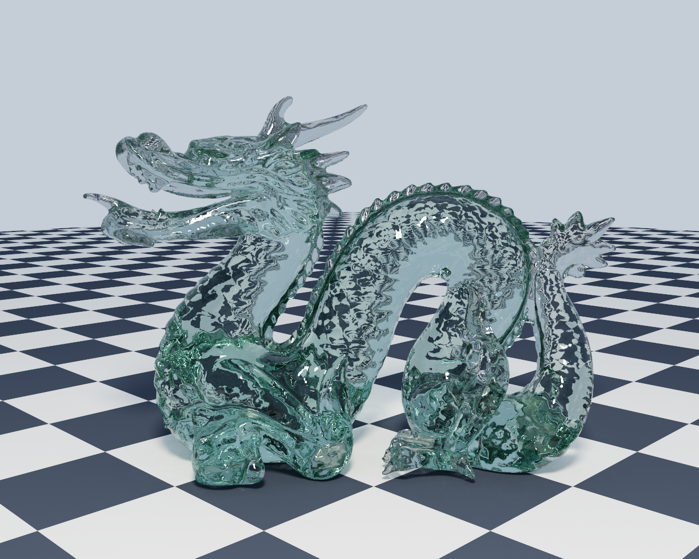

# Steradian

A Monte Carlo path tracer, written from scratch in C++, running on the CPU.


Named for the SI unit of solid angle, because integrating incoming light over the
hemisphere above a surface is what the renderer spends all of its time doing.

---

## Building

Requires **CMake 3.22 or newer** and a **C++20** compiler.

```sh
git clone --recurse-submodules https://github.com/DanKane2029/Steradian.git
cd Steradian
scripts/build.sh --test
```

`scripts/build.sh` configures, builds, and optionally runs the tests. It fetches any
missing submodules and, if the viewer's dependencies were installed without root, points
CMake at them so those arguments do not have to be remembered.

| | |
| --- | --- |
| `scripts/build.sh` | configure and build |
| `scripts/build.sh --test` | ...and run the test suite |
| `scripts/build.sh --clean --test` | ...from scratch |
| `scripts/build.sh --debug` | a debug build |
| `scripts/build.sh --no-viewer` | headless only |
| `scripts/build.sh --gpu` | with GPU support, fetching its dependencies if needed |

Each configuration builds into its own directory, so switching between release and debug
does not force a rebuild each time.

Or drive CMake directly:

```sh
cmake -B build -DCMAKE_BUILD_TYPE=Release
cmake --build build -j
```

If you already cloned without `--recurse-submodules`, run `git submodule update --init`
first.

Prefer `Release`. The renderer is built from many small vector operations that depend on
being inlined, so an unoptimized build is not merely slower, it is unusable. Without an
explicit build type the project defaults to `RelWithDebInfo` rather than a debug build for
that reason.

### The interactive viewer

The viewer needs OpenGL and X11 development headers. Without them CMake prints a warning
and builds a **headless-only** binary rather than failing, so the renderer still works.

```sh
sudo apt install libgl1-mesa-dev xorg-dev     # Debian / Ubuntu
```

No root? `scripts/setup-deps.sh` fetches the same packages with `apt-get download`, which
needs no privileges, unpacks them into `~/.local/sysroot`, and points the development
symlinks at the runtime libraries already on the system:

```sh
scripts/setup-deps.sh
cmake -B build -DCMAKE_BUILD_TYPE=Release \
    -DCMAKE_PREFIX_PATH="$HOME/.local/sysroot/usr" \
    -DCMAKE_LIBRARY_PATH="$HOME/.local/sysroot/usr/lib/x86_64-linux-gnu"
```

### GPU support

The renderer runs on the GPU. A build without `PT_ENABLE_GPU` is byte-for-byte the same
as one from before any of this existed, and the CPU renderer is untouched — it is the
correctness oracle the GPU backend is checked against.

```sh
scripts/build.sh --gpu
./build-gpu/src/steradian --gpu-info

./build-gpu/src/steradian --config res/configs/test_config.json \
                          --scene  res/scenes/dragon.json \
                          --out    render.png --samples 256 --device gpu
```

At 400x320 and 64 samples per pixel, against eight CPU threads:

| Scene | CPU | GPU | |
|---|---|---|---|
| `cornell_box` | 0.77 s | 0.044 s | 18x |
| `dragon` | 21.64 s | 0.036 s | **605x** |
| `glass_dragon` | 34.93 s | 0.047 s | **742x** |
| `bunny` | 30.09 s | 0.033 s | **915x** |

The Cornell box gains least, which is the shape of the result rather than a
disappointment: it is a ten-triangle scene that the CPU already renders in under a second,
so there is little there to win.

Two costs are deliberately kept out of those figures and reported separately, because
neither is rendering and both are larger than the render. **Setup** — compiling the device
code and building the acceleration structure — is about 0.9 s, paid once. **Teardown** of
the CUDA context is about 85 milliseconds, which is more than twice a whole frame. An
earlier version of this table was measured with a wall clock either side of the call and
so quietly included both; the numbers it gave were between four and thirty times too
pessimistic.

Most of what a GPU path needs is already present on any machine with an NVIDIA driver.
`libcuda.so.1` and OptiX itself, `libnvoptix.so.1`, both ship *with the display driver*
rather than with an SDK, so there is no CUDA toolkit to install. What is missing is only
the headers to compile against plus NVRTC, and `scripts/setup-gpu-deps.sh` fetches those
without root: about 31 MB from NVIDIA's redistributable archives and the public OptiX
headers from GitHub. They land in `third_party/gpu/` and are not checked in.

One consequence worth knowing before turning it on: a binary built with `PT_ENABLE_GPU=ON`
links `libcuda.so.1` and will not start at all on a machine without an NVIDIA driver, even
to render on the CPU. That is why the option is off by default, and why the ordinary
build, the tests and CI never touch any of it.

There is deliberately no `nvcc`. Device code is compiled from source at run time by
NVRTC, which is how OptiX is normally driven, and which sidesteps a real conflict here:
the CUDA 12.0 `nvcc` supports GCC up to 12, and this project builds with GCC 13.

On the machine this was developed on, `--gpu-info` reports an RTX 3060 Ti with 58,368
resident threads and **RT core version 20** — the fixed-function ray/box intersection
hardware. That last number is the one that matters: the dragon spends 658 bounding box
visits per ray against 87.5 triangle tests, so traversal is the cost, and traversal is
exactly what that silicon does.

#### The viewer

`--device gpu` drives the interactive viewer as well as a headless render, which is where
the speed stops being a number in a table and becomes something you can feel. On
`glass_dragon` at 1000x800, with the camera left still for fourteen seconds:

| | samples reached | frame rate |
|---|---|---|
| CPU, 8 threads | 2 | 0.2 fps |
| GPU | **2,655** | 3.4 fps |

The renderer decides how many samples to take per frame rather than fixing it at one,
because a moving camera and a still one want opposite things. While the camera moves every
sample is about to be discarded and only responsiveness matters, so it drops to a single
sample — 19 ms for a 1000x800 frame. While it is still, nobody is waiting on input, so
frames are allowed to grow until the picture settles quickly, bounded so that moving again
is noticed promptly.

Worth knowing where the remaining time goes: at one sample per frame the render is 19 ms
and the display path — tone mapping 800,000 pixels on the CPU and uploading them — is most
of the rest. The GPU is no longer the limit at that end, which is what makes CUDA/OpenGL
interop the obvious next thing to try rather than something to have done up front.

#### Being sure it is right before being pleased it is fast

None of those numbers were measured until the backend was shown to be correct, which took
three separate checks, because the interesting failure is a fast renderer that is subtly
wrong.

**The furnace test ports directly, and is the sharpest of the three.** A fully reflective
surface in a uniform environment must render as exactly that environment. It asserts a
physical invariant rather than a stored number, so it transfers to a new backend without
losing any force, and it needs no reference image that could be quietly re-baselined. The
GPU renders it at 0.00% error for a diffuse surface and 0.01% for a rough conductor.

**GPU output is deterministic.** The same seed gives a byte-identical image across runs.
That is what makes anything else about it testable.

**The two backends converge to the same image.** They cannot produce the same *pixels* —
the CPU seeds per row and consumes that row's stream left to right, which threads running
at once cannot reproduce, so the GPU seeds per pixel and carries different noise. What is
asserted instead is that they differ from each other by no more than either differs from
*itself* at another seed. Measured across six scenes that ratio sits between 0.99 and
1.03, and both differences fall as the square root of the sample count, which is what
unbiased estimators of the same integral do.

That last test is deliberately narrow, and the narrowness was measured rather than
assumed. Deleting direct light sampling from the device path takes the ratio to 9.1 and
13.5, so gross divergence is caught by an order of magnitude. A *small* bias confined to
part of the image is not: deleting the conductor energy compensation moves it only to
1.03. A per-block version was tried to reach those, and it gave 2.6 for that real bias
and 3.8 for a scene with none — in near-noiseless blocks it divides a tiny difference by a
tinier noise floor — so it was dropped rather than tuned until it passed. Localized energy
errors belong to the furnace test, which shows that same deleted compensation as a 44%
error against a 2% tolerance.

#### Traversal on the RT cores

An OptiX pipeline builds the acceleration structure from the same flat arrays the CPU
uses, and traces against it. Triangles go through OptiX's built-in intersection so the
hardware does the work; spheres are custom primitives intersected by a program that mirrors
the CPU's own test, because using OptiX's built-in sphere would mean maintaining a second
implementation of something this project already has.

Whether that is *correct* is checked the same way the CPU hierarchy was — against a
reference that is already trusted. `device_traversal` fires the same rays at both backends
and compares. Across seven scenes and 200,000 rays each, from three primitives up to the
dragon's 202,522 triangles:

| | |
|---|---|
| hit/miss disagreements | **0** |
| wrong primitive reported | **0** |
| worst distance difference | 1.3e-4 relative |

Exact agreement is neither expected nor asked for: OptiX intersects triangles with its own
watertight algorithm on dedicated hardware rather than with this project's
Möller-Trumbore. A ray grazing a shared edge may legitimately be given to either triangle.
What would not be legitimate is a systematic disagreement, and deleting the offset that
maps sphere indices into the shared numbering makes 6.7% of hits report the wrong
primitive — 130 times the threshold — which is how that test was checked for teeth.

Traversal alone, against a single CPU thread:

| Scene | GPU | CPU (1 thread) |
|---|---|---|
| `cornell_box` | 174 M rays/s | 9.2 M rays/s |
| `dragon` | **240 M rays/s** | 7.2 M rays/s |

The interesting number is not the ratio, it is that the GPU is **faster on the dragon than
on the Cornell box** while the CPU is slower — the dragon's 658 box visits per ray are
what the RT cores exist to absorb. What any of this is worth to a finished image is the
next stage's question, and it will be answered by rendering one rather than by scaling
these.

#### One copy of the maths

`Vec3`, the generator, the sampling routines and the microfacet model compile unchanged as
host C++ *and* as device code. There is no second implementation to keep in step, because
two copies of a BSDF drift apart and the drift surfaces as an image that is subtly wrong on
one backend in a way no test written against either backend alone would catch.

What made that possible was mostly subtraction. `Vec3` had grown an `<iostream>`, a
`std::vector` constructor and an exception; NVRTC has no standard library at all, so those
went to the scene loader, which is the only place that ever wanted them. The one thing that
genuinely cannot cross is the energy compensation table, which is *measured* at load by
sampling the microfacet routines a few million times — so the measuring stayed on the host
and only the lookup is shared, with the table passed in.

The claim is tested rather than asserted. `device_parity` reads those header files out of
the source tree, compiles them with NVRTC, runs them on the GPU and compares against the
host's own answers for 65,536 random inputs. Editing `Vec3.h` to use `std::vector` again
fails that test rather than Stage 3.

Two standards are applied, because two different things are being claimed. The generator
must agree **bit for bit** — it is integer arithmetic, and everything else depends on both
sides drawing the same numbers. The floating point quantities must agree **closely**:
CUDA's `sinf` is not glibc's, and no amount of care makes them identical. Seventeen of the
twenty quantities agree to 6e-5 absolute or better. The other three are unbounded — a
near-mirror GGX lobe evaluates into the thousands — and agree to 5.4e-4 relative. The
thresholds sit an order of magnitude above the worst observed, and were checked for teeth
by deleting a term from the masking function: that shows up at 8.7e-1, roughly 180 times
outside them.

### Build options

| Option | Default | Meaning |
| --- | --- | --- |
| `PT_BUILD_VIEWER` | `ON` | Build the interactive viewer |
| `PT_BUILD_TESTS` | `ON` | Build the test suite |
| `PT_ENABLE_STATS` | `ON` | Collect ray, node and primitive counters |
| `PT_ENABLE_GPU` | `OFF` | Build against the CUDA driver API and OptiX. See below |
| `PT_NATIVE_ARCH` | `OFF` | Compile with `-march=native`. Off by default because it changes floating point results between machines, which would make the reference images non-portable |

---

## Running

Two ways to use it. Leave `--out` off and a window opens that refines the picture as you
watch; pass `--out` and it renders once to a file.

```sh
# interactive
./build/src/steradian --config res/configs/test_config.json \
                      --scene  res/scenes/cornell_box.json

# to a file
./build/src/steradian --config res/configs/test_config.json \
                      --scene  res/scenes/cornell_box.json \
                      --out    render.png --samples 512
```

`res/configs/test_config.json` renders at 1000x800. For quick experiments use
`tests/test_config.json` instead, which is 160x120 and about forty times faster.

Renders worth keeping go in `renders/`, which is not committed — see the note there for
why, and for what actually improves a picture once the obvious knob stops working.

### Options

| Flag | Meaning |
| --- | --- |
| `--config <path>` | Config JSON: resolution, thread count, maximum path depth |
| `--scene <path>` | Scene JSON: camera, materials, objects |
| `--out <path>` | Write a PNG. Implies `--headless` |
| `--samples <n>` | Samples per pixel (default 16). The quality dial |
| `--seed <n>` | Base seed (default 1) |
| `--threads <n>` | Worker threads (default: from the config) |
| `--adaptive [t]` | Stop sampling a pixel once its estimate has settled, up to `--samples` (default tolerance 0.02) |
| `--denoise [n]` | Filter noise using surface colour and normals as a guide (default 5 passes). Applies to both saved images and the viewer |
| `--denoise-strength <v>` | How much radiance difference the filter blurs across (default 0.10) |
| `--headless` | Render once and exit without opening a window |
| `--device <cpu|gpu>` | Which backend renders (default cpu) |
| `--gpu-info` | Report the GPU, OptiX and NVRTC this build can see, then exit |
| `--help` | Full usage, including the viewer controls |

`--samples` is the dial that matters. Cost is linear in it and noise falls as its square
root, so four times the samples costs four times as long and halves the noise.

### Viewer controls

| Input | Action |
| --- | --- |
| `W` `A` `S` `D` | Move forward, left, back, right |
| `Q` `E` | Move down, up |
| Hold `Shift` | Move four times faster |
| Left-drag | Look around |
| `[` `]` | Decrease / increase movement speed |
| `R` | Return to the camera the scene file specifies |
| `Esc` | Quit |

The window refines its image continuously: every frame adds another sample per pixel and
the buffer holds the running average, so leaving the camera still lets the picture settle.
Moving discards what has accumulated, because those samples measured light arriving at a
viewpoint that no longer exists. The title bar shows accumulated samples, frame rate and
movement speed.

### Included scenes

| Scene | What it shows |
| --- | --- |
| `cornell_box` | Global illumination: colour bleeding, soft shadows, a mirror |
| `glossy_spheres` | Conductors at three roughnesses |
| `glass_lens` | Refraction: a glass sphere inverts the scene behind it |
| `glass_tinted` | Absorption: clear, tinted and deeply coloured glass |
| `two_spheres` | A diffuse and a metal sphere under a sky |
| `textured_spheres` | Two spheres sharing one image texture, tinted differently |
| `single_sphere`, `single_triangle` | Minimal scenes |
| `test_obj_ball` | A 960 triangle mesh |
| `test_man_obj` | A 48,918 triangle mesh |
| `bunny` | The Stanford Bunny, 69,451 triangles |
| `dragon` | The Stanford Dragon, 202,520 triangles |
| `glass_dragon` | The same dragon in tinted glass, over a checkered floor |

### Testing

```sh
ctest --test-dir build --output-on-failure
```

Twenty-two tests, about twenty-four seconds. Most of that is path tracing the two
Stanford models; everything else finishes in around three. A GPU build adds sixteen
more, covering the shared maths, the traversal, the furnace invariant on the device, and
cross-backend agreement.

Formatting is checked by the same script continuous integration runs, so the two cannot
disagree about which files are covered:

```sh
scripts/format.sh              # format in place
scripts/format.sh --check      # report and change nothing, as CI does
```

---

## What it does

Steradian estimates how light travels through a scene by simulating it: rays are traced
from the camera, bounce off surfaces, and either find a light or are eventually abandoned.
Averaging enough of those paths per pixel produces an image.

The distinguishing feature of that approach is that effects other renderers approximate
come out of it for free. Nothing in the code draws a soft shadow, or tints a white sphere
red because it sits near a red wall, or dims a corner where less light reaches. Those are
all consequences of following light around a room, and they appear because the simulation
is what it is.


### How a path is traced

Each camera ray starts a walk through the scene, carrying a *throughput* that records how
much of the original light survives each interaction. At every surface the renderer:

- adds any light the surface emits,
- samples the light sources directly to find illumination arriving there,
- picks a new direction to continue in, weighted by how the surface scatters, and
- multiplies the throughput by that scattering.

Once the throughput is small enough that the path can no longer matter much, it is
terminated at random by **Russian roulette**, with the survivors scaled up to compensate,
so nothing is lost on average.

Several choices in that loop exist purely to reduce noise, which is the currency a path
tracer trades in:

**Cosine-weighted sampling.** The equation being solved already contains a cosine factor.
Drawing bounce directions in proportion to it makes the two cancel, so a diffuse bounce
reduces to multiplying by the surface colour, and contributes no variance of its own.

**Direct light sampling.** Rather than hoping a scattered ray happens to strike a light,
each surface aims at the lights deliberately, sampling the cone of directions each one
subtends. Waiting for chance is what makes naive path tracers so slow: a small bright light
is hit rarely, and each hit then carries enormous weight.

**Multiple importance sampling.** Aiming at lights works well for a small distant source
and badly for one that fills the sky; following the surface's own scattering is the
reverse, and on a glossy surface far better still. Both are used, weighted by which was
more likely to have produced each direction, so no scene has to be classified in advance.
On glossy geometry this is worth **1.8x less noise**, about the same as tripling the sample
count.

**Stratified samples.** Samples within a pixel are spread over a jittered grid rather than
drawn independently, which would let them clump together and leave parts of the pixel
uncovered.

**Adaptive sampling** (`--adaptive`, off by default). Noise is not spread evenly across an
image. A flat wall lit by one light settles in a handful of samples; a corner gathering
light bounced from everywhere around it may still be moving after hundreds. Sampling both
the same number of times spends most of the render refining pixels that stopped changing
early on.

Each pixel tracks the mean and variance of its own samples and stops once the standard
error of that mean falls below `t` times its brightness, so the threshold is relative and
dark regions are not held to a brighter region's absolute standard. Sixteen samples are
taken before the test is applied at all, since a variance estimate from fewer than that is
mostly noise itself, and every pixel is judged only on its own samples, which is what keeps
the render independent of how the image was split across threads.

What this is worth depends entirely on how uneven the scene is:

| Scene | Fixed | Adaptive | Samples used |
|---|---|---|---|
| `bunny` (large flat floor and sky, detailed subject) | 84.3 s | **64.3 s** | 50% |
| `cornell_box` (every pixel about equally difficult) | 3.23 s | 3.16 s | 86% |

On the bunny that is a quarter of the render time for 7% more noise, or roughly 13% ahead
once the extra noise is paid back in samples. On the Cornell box it is a wash, and honestly
so: every pixel there is difficult, so there is nothing to stop early. Adaptive sampling
does not make hard pixels cheaper, it only stops paying for easy ones, and a scene made
entirely of hard pixels has none to skip. It is off by default for that reason.

One subtlety worth recording. Early termination is incompatible with the jittered grid
above, because the grid is filled in order: a pixel stopping after 16 of 484 cells has
sampled a thin strip across its top rather than its area. The first version of this did
exactly that, and the symptom was that the tolerance had no effect at all — 0.02 and 0.002
gave the same noise and the same sample count, because the error was in coverage rather
than in the stopping rule. The adaptive path uses a Halton sequence instead, which spreads
evenly at *every* prefix length. Measured at matched sample counts the two are equivalent
(9.80 vs 9.82 RMS at 64 spp), so the sequence is not itself an improvement; being able to
stop anywhere is.

### Materials

| Type | Behaviour |
| --- | --- |
| `diffuse` | Lambertian. `albedo` is the fraction of light reflected |
| `metal` | GGX microfacet conductor. `albedo` tints the reflection, `roughness` sets the width of the highlight |
| `dielectric` | Glass. Refracts with Fresnel-weighted reflection and total internal reflection, controlled by `ior` (1.5 is typical glass), and absorbs along the path through its interior via `absorption` |

Any material can carry a `checker` instead of a flat colour, which alternates its `albedo`
with a second one over squares of a given size.

Any material with a non-zero `emissive` is a light. There are no light objects as such:
lights are simply geometry that emits, and the older `lights` array in a scene file is
converted into emissive spheres when it loads.

Roughness is a real microfacet model rather than a blurred mirror, which matters for more
than looks. It gives glossy surfaces an evaluable probability density, and without one they
cannot take part in the importance sampling above at all.

A microfacet model follows light striking a surface, bouncing once, and leaving. Light that
would have bounced between facets before escaping is simply dropped, and the rougher the
surface the more of it there is, which makes rough metal render too dark. How much is lost
is measured at startup, by sampling the renderer's own scattering routine rather than
taking a published fit, and put back:

| Roughness | 0.4 | 0.6 | 0.8 | 1.0 |
| --- | --- | --- | --- | --- |
| Reflected, single bounce only | 0.96 | 0.82 | 0.56 | 0.32 |
| Reflected, with the rest restored | 1.00 | 1.00 | 1.00 | 0.96 |

### Finding what a ray hits

<p align="center">
  
  
</p>

Testing every ray against every triangle is hopeless at any real scene size, so primitives
are organized into a **bounding volume hierarchy** built with a binned surface area
heuristic. It is flattened into one contiguous array and walked iteratively, entering the
nearer child first and shrinking the ray's far limit at every hit, so whole subtrees lying
beyond the closest intersection found so far are skipped without being visited.

The dragon above holds 202,520 triangles and costs about **52** primitive tests per ray.
An earlier structure, which never tested a bounding box at all, spent **52,309** tests per
ray on a mesh a quarter that size.

How many primitives a leaf may hold matters more than it appears, because every leaf a ray
reaches costs a test against each primitive inside it. A generous leaf therefore multiplies
the cost of every visit. Reducing it from 25, a figure inherited from an earlier
acceleration structure where it was appropriate, to 2 cut the bunny from 1,343 primitive
tests per ray to 109, and rendering time by nearly threefold, with no measurable change to
build time or memory and no change whatsoever to the resulting image.

Shadow rays use a separate query that stops at the first thing it meets, since they only
need to know whether the light is visible, not what is nearest.

### How the geometry is stored

Primitives are held in flat typed arrays rather than as individually allocated polymorphic
objects: one shared vertex buffer, a 16-byte triangle of three indices and a material, and
a separate sphere array. Intersection is a direct call on an index instead of a virtual
call through a pointer. The dragon was 202,523 separate heap allocations and is now four
arrays.

What an intersection test *reports* was cut down too, from 88 bytes to 16 — a distance, two
barycentric weights and a primitive index. A ray against the dragon runs about 88 primitive
tests and keeps one, so interpolating a normal and a texture coordinate inside every test
was paying for work that was thrown away almost every time. Those are now derived once, for
the primitive that wins.

Two things had to be measured rather than assumed. Indexed vertices are the right way to
*store* a mesh but the wrong way to *read* one: following an index to a triangle to its
three scattered vertices is a chain of dependent loads, and it cost more than the virtual
call it replaced, leaving the first version of this layout **17% slower** on the dragon
while doing provably identical work — the same node visits and the same primitive tests,
only slower to fetch. The fix is to also keep the triangles de-indexed and pre-differenced
in the form the test actually wants, and to renumber primitives and vertices into the order
traversal reads them.

The result, at 400×320 and 32 samples per pixel, against the polymorphic version:

| Scene | Render time | Peak memory |
| --- | --- | --- |
| `cornell_box` | 0.76 s → **0.60 s** | — |
| `test_man_obj` | 1.09 s → **1.05 s** | — |
| `bunny` | 24.88 s → **24.70 s** | 32.8 MB → **23.8 MB** |
| `dragon` | 16.11 s → **16.00 s** | 77.0 MB → **52.3 MB** |

Materials went the same way, from 136 bytes to 68. A material no longer carries its own
name or owns its own texture — the name lives in the scene's load-time lookup table and
the texture in a shared array the material indexes into, so two materials naming the same
file load it once. What is left is a block of numbers, and a static assertion keeps it
that way: adding anything that owns memory breaks the build rather than the eventual port.

The honest reading is that the memory win is the large one, and the time win is
concentrated where per-test overhead dominates. On the heavy meshes it is barely more than
noise, and the counters say why: the dragon spends 658 node visits per ray against 87.5
primitive tests, so it is bounded by box tests, which this change does not touch. Every
scene renders byte-for-byte the same image as before.

### Coloured glass


A material's colour can come from its surface or from its interior, and for glass it is
the interior that matters. Light is absorbed as it travels *through* the material, so how
much survives depends on the distance covered: each sphere above is lighter at its rim,
where light passes through only a little glass, and deepest through its middle. Doubling
the thickness squares the fraction that gets out rather than halving it.

A surface tint cannot do this, having no notion of how far anything travelled. Set
`absorption` per channel; the channel that survives is the colour you see, so absorbing
red leaves the blue green cast of thick window glass.

### Checkered surfaces



1280x1024 at 32,000 samples per pixel: 3.5 minutes on the GPU, and around twelve hours on
eight CPU threads. Rendered at the size shown rather than scaled down from something
larger, because at these speeds the renderer is the better resampler.

Sampling harder stops helping sooner than expected: the error is already around 0.3% of
range by sixteen thousand samples, and deeper paths change nothing either, 8, 24 and 64
bounces being indistinguishable. Resolution is where the remaining time goes. A 3840x3072
version renders in 37 minutes; see `renders/` for how to make one.

The caustics are continuous because the surface is. Vertex normals are interpolated across
each triangle from its barycentric coordinates, so a mesh shades as the smooth surface it
approximates rather than as the flat facets it is made of. Refraction is unforgiving about
this in a way diffuse shading is not: a facet edge deflects a transmitted ray by a visible
angle, so a faceted glass model does not merely look a little blocky, it scatters light
into a harsh glitter that is easy to mistake for noise.

A checker is the traditional thing to put under a glass object, and for a reason worth
stating: it is a pattern whose correct appearance is known in advance. Straight lines stay
straight, squares stay square, and the whole thing runs to a vanishing point. Anything that
refracts, reflects or magnifies it is measured against that, so errors that a photograph of
a real object would hide have nowhere to go. In the image above the floor seen through the
dragon's body is inverted and bent, but it is still made of squares.

Set `checker` on any material with a second colour and a square size:

```jsonc
"floor": { "type": "diffuse", "albedo": [0.81, 0.79, 0.75],
           "checker": { "albedo": [0.07, 0.08, 0.1], "scale": 0.5 } }
```

The pattern is keyed on where a point is in the world rather than on texture coordinates.
Large flat surfaces are usually written straight into a scene as a pair of triangles, and
those carry no useful texture coordinates at all, so a checker that needed them would not
work on the surfaces that most want one.

That choice has one sharp edge, which is worth knowing about because the symptom does not
look like its cause. Every cell boundary is a discontinuity, so a surface lying exactly on
one has no well defined colour: whether a hit lands a hair above or below the plane decides
which square it belongs to, and intersection results carry exactly that much error. A floor
on `y = 0` with a square size that divides evenly hits this every time, and comes out
speckled rather than checkered. The grid is therefore offset by half a square, which puts
those surfaces in the middle of a cell instead of on its edge. `tests/checker_test.cpp`
asserts it, and fails on all three of its plane cases without the offset.

### Colour

Radiance is accumulated in linear space and left unbounded: a light source really is
hundreds of times brighter than a wall, and clamping it early would throw that away. Only
at the point of display or writing a file is the image tone mapped with an ACES curve and
encoded to sRGB.

Doing it in that order matters. Tone mapping each sample and then averaging would give a
different, wrong answer, because those curves are not linear.

### Denoising

A path traced image is noisy because each pixel averages a limited number of random paths.
Crucially the noise is confined to the *lighting*: which surface is visible at a pixel and
which way it faces are known almost exactly from a single sample, since neither depends on
where the light came from.

`--denoise` exploits that asymmetry. The renderer writes albedo and normal buffers
alongside the image, and the filter blurs the lighting hard while refusing to cross edges
those guides reveal. Two pixels on the same flat wall are averaged freely; two spanning a
wall-to-floor boundary are not.

It is an approximation, and the one part of the renderer that cannot be checked against a
ground truth, because changing the image is its entire purpose. Reflections blur, since the
guides describe the surface rather than what it reflects, and fine lighting detail softens.
Measured against a converged reference it is worth roughly 1.3x the sample count, while the
improvement to the eye is considerably larger: noise is far more objectionable than a
slight loss of detail, which is exactly the trade being made.

### Determinism

A render depends only on its seed and sample count. The same arguments produce a
byte-identical image regardless of how many threads are used, because generators are seeded
per image row rather than per worker, and each row belongs to exactly one thread.

That property is what makes the test suite possible. Rendering is otherwise awkward to
test: the correct output of a stochastic algorithm is not a fixed value, and small changes
legitimately alter every pixel.

---

## How it is tested

Twenty-two tests, running in about twenty-four seconds, plus sixteen more on a GPU build.

**Reference images.** Thirteen scenes rendered at a fixed seed and sample count, compared
against committed references. Tolerances are tight, and were chosen by measuring what a
deliberately introduced 2% brightness error actually looks like rather than by picking a
number that felt safe.

**Determinism.** The same scene at one, three and eight threads must produce identical
bytes, with adaptive sampling both off and on. Adaptive is where that property is easiest
to lose, since how many samples a pixel takes is decided while rendering.

**Procedural checker.** A plane lying exactly on a cell boundary must have one colour per
point. That is the arrangement every scene here uses, a floor on `y = 0`, and getting it
wrong speckles the floor rather than failing outright. The test sweeps across the plane and
compares each point against the same point nudged either side of it; all three of its plane
cases fail if the half-square offset that guards this is removed.

**Acceleration structure agreement.** For thousands of random rays per scene, the
hierarchy must return exactly what a brute force scan over every primitive returns. Image
comparisons prove the final picture is right; this proves the structure is not quietly
dropping or inventing intersections, which is a failure that otherwise hides easily.

**Energy conservation.** A surface that reflects all light, placed in an environment of
uniform brightness, must render as exactly that brightness and disappear into it. Nearly
every possible mistake in the path loop makes it visible instead: a dropped cosine, a
probability applied the wrong way round, a bounce that loses throughput. One test covers a
great deal of ground. It currently measures 0.00% error for diffuse surfaces, and a second
version covers rough conductors.

Renders also report their own statistics, which is how claims about the acceleration
structure get checked:

```
rays traced      50048
node visits      635010 (12.7 per ray)
primitive tests  1662720 (33.2 per ray)
```

Primitive tests per ray is the number worth watching. It does not depend on machine speed
or system load, and it falls only if traversal is genuinely rejecting geometry.

---

## Scene format

```jsonc
{
  "ambientLighting": [0.45, 0.55, 0.75],       // uniform light from every direction
  "camera": {
    "org":    [0, 0, 3.6],                     // position
    "lookAt": [0, 0, 0],
    "fov":    45,                              // optional, vertical degrees (default 60)
    "up":     [0, 1, 0]                        // optional
  },
  "materials": {
    "white": { "type": "diffuse", "albedo": [0.73, 0.73, 0.73] },
    "floor": { "type": "diffuse", "albedo": [0.81, 0.79, 0.75],
               "checker": { "albedo": [0.07, 0.08, 0.1], "scale": 0.5 } },
    "gold":  { "type": "metal", "albedo": [0.95, 0.78, 0.42], "roughness": 0.2 },
    "glass": { "type": "dielectric", "albedo": [1, 1, 1], "ior": 1.5 },
    "lamp":  { "type": "diffuse", "albedo": [0, 0, 0], "emissive": [26, 22, 18] }
  },
  "objects": [
    { "type": "sphere",   "material": "gold",  "center": [0, 0, 0], "radius": 1 },
    { "type": "triangle", "material": "white", "point0": [0,0,0], "point1": [1,0,0], "point2": [0,1,0] },
    { "type": "objModel", "material": "white", "path": "../models/ball.obj",
      "translate": [0, -0.6, 0],                // all three are optional
      "rotate":    [0, 45, 0],                  // degrees, applied about X then Y then Z
      "scale":     0.5 }                        // one number, or [x, y, z]
  ]
}
```

Paths inside a scene are resolved relative to the scene file, so scenes and models can be
moved or checked out anywhere. Triangles may carry optional `normal0/1/2` for smooth
shading.

Any object accepts `translate`, `rotate` and `scale`, applied in that order reading
backwards: scaled first, then rotated, then moved, which is what makes a rotation turn an
object in place rather than sweeping it around the origin. A model can therefore be placed
where you want it rather than the camera having to be moved to wherever the model's own
coordinates happen to be.

Transforms are applied once when the scene loads, so they cost nothing per ray. A sphere
takes only a uniform scale, since one radius cannot describe an ellipsoid; a non-uniform
scale on one is reported and the largest factor used.

The config file is separate because it describes the render rather than the scene:

```jsonc
{
  "windowWidth": 1000, "windowHeight": 800,
  "numThreads": 8,
  "numChildrenInBVHLeafNodes": 25,
  "maxRecurseLevel": 10                        // maximum path length, in bounces
}
```

---

## Layout

| Path | Contents |
| --- | --- |
| `src/RayTracer/` | Camera, ray generation, and the path tracing integrator |
| `src/Scene/` | Scene description, primitives, materials, acceleration structure |
| `src/Utils/` | Vector maths, sampling, microfacet model, denoiser, thread pool, OBJ and image handling |
| `src/Window/` | Pixel buffer, and the optional viewer and camera controls |
| `tests/` | Reference images and the checks described above |
| `res/` | Scenes, configs and models. See `res/models/ATTRIBUTION.md` |
| `docs/` | Images used by this page |

`RayTracer`, `Scene` and `Utils` include each other cyclically and build as a single
library. Only the viewer depends on GLFW and OpenGL, which is what keeps headless builds,
and therefore continuous integration, possible.

---

## Known limitations

- **Dielectric surfaces are smooth.** Roughness applies to conductors, so frosted or
  etched glass is not available.
- **Direct light sampling covers spherical emitters only.** Emissive geometry of other
  shapes still lights a scene correctly, through ordinary path tracing, but more noisily.
- **Textures are not wired up.** Texture coordinates are loaded and interpolated and the
  sampling code exists, but no material reads from them yet.
- **Adaptive sampling is per-pixel only.** Samples saved on an easy pixel are not
  redistributed to a hard one, so a render finishes sooner rather than arriving at less
  noise for the same time. Spending a shared budget where it does the most good would be
  the stronger version, at the cost of the per-pixel independence that currently makes the
  output identical regardless of thread count.
