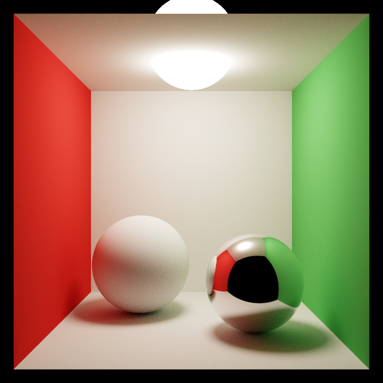
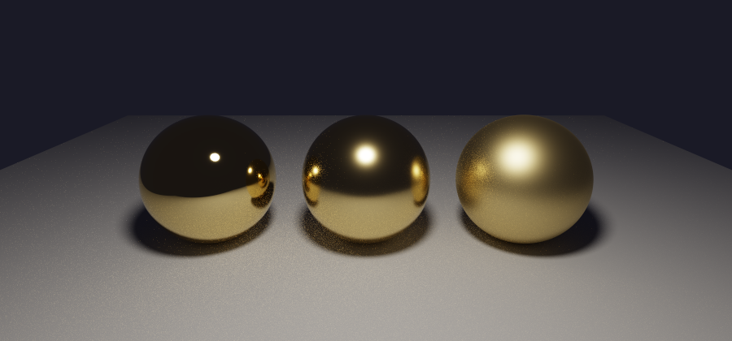
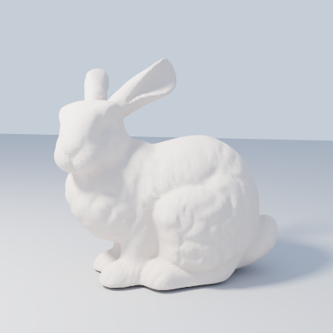
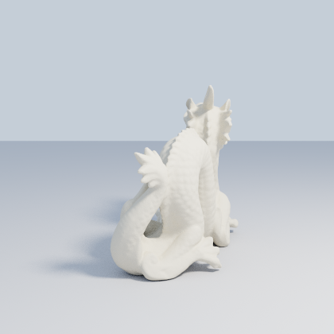
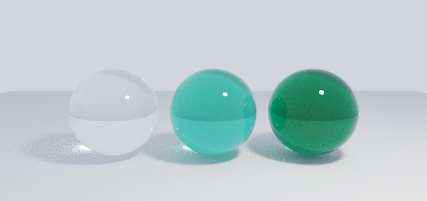

# Steradian

A Monte Carlo path tracer, written from scratch in C++, running on the CPU.



Named for the SI unit of solid angle, because integrating incoming light over the
hemisphere above a surface is what the renderer spends all of its time doing.

---

## Building

Requires **CMake 3.22 or newer** and a **C++20** compiler.

```sh
git clone --recurse-submodules https://github.com/DanKane2029/Steradian.git
cd Steradian
cmake -B build -DCMAKE_BUILD_TYPE=Release
cmake --build build -j
```

If you already cloned without `--recurse-submodules`, run `git submodule update --init`
first.

Prefer `Release`. The renderer is built from many small vector operations that depend on
being inlined, so an unoptimized build is not merely slower, it is unusable. Without an
explicit build type the project defaults to `RelWithDebInfo` rather than a debug build for
that reason.

### The interactive viewer

The viewer needs OpenGL and X11 development headers. Without them CMake prints a warning
and builds a **headless-only** binary rather than failing, so the renderer still works.

```sh
sudo apt install libgl1-mesa-dev xorg-dev     # Debian / Ubuntu
```

No root? `scripts/setup-deps.sh` fetches the same packages with `apt-get download`, which
needs no privileges, unpacks them into `~/.local/sysroot`, and points the development
symlinks at the runtime libraries already on the system:

```sh
scripts/setup-deps.sh
cmake -B build -DCMAKE_BUILD_TYPE=Release \
    -DCMAKE_PREFIX_PATH="$HOME/.local/sysroot/usr" \
    -DCMAKE_LIBRARY_PATH="$HOME/.local/sysroot/usr/lib/x86_64-linux-gnu"
```

### Build options

| Option | Default | Meaning |
| --- | --- | --- |
| `PT_BUILD_VIEWER` | `ON` | Build the interactive viewer |
| `PT_BUILD_TESTS` | `ON` | Build the test suite |
| `PT_ENABLE_STATS` | `ON` | Collect ray, node and primitive counters |
| `PT_NATIVE_ARCH` | `OFF` | Compile with `-march=native`. Off by default because it changes floating point results between machines, which would make the reference images non-portable |

---

## Running

Two ways to use it. Leave `--out` off and a window opens that refines the picture as you
watch; pass `--out` and it renders once to a file.

```sh
# interactive
./build/src/steradian --config res/configs/test_config.json \
                      --scene  res/scenes/cornell_box.json

# to a file
./build/src/steradian --config res/configs/test_config.json \
                      --scene  res/scenes/cornell_box.json \
                      --out    render.png --samples 512
```

`res/configs/test_config.json` renders at 1000x800. For quick experiments use
`tests/test_config.json` instead, which is 160x120 and about forty times faster.

### Options

| Flag | Meaning |
| --- | --- |
| `--config <path>` | Config JSON: resolution, thread count, maximum path depth |
| `--scene <path>` | Scene JSON: camera, materials, objects |
| `--out <path>` | Write a PNG. Implies `--headless` |
| `--samples <n>` | Samples per pixel (default 16). The quality dial |
| `--seed <n>` | Base seed (default 1) |
| `--threads <n>` | Worker threads (default: from the config) |
| `--adaptive [t]` | Stop sampling a pixel once its estimate has settled, up to `--samples` (default tolerance 0.02) |
| `--denoise [n]` | Filter noise using surface colour and normals as a guide (default 5 passes). Applies to both saved images and the viewer |
| `--denoise-strength <v>` | How much radiance difference the filter blurs across (default 0.10) |
| `--headless` | Render once and exit without opening a window |
| `--help` | Full usage, including the viewer controls |

`--samples` is the dial that matters. Cost is linear in it and noise falls as its square
root, so four times the samples costs four times as long and halves the noise.

### Viewer controls

| Input | Action |
| --- | --- |
| `W` `A` `S` `D` | Move forward, left, back, right |
| `Q` `E` | Move down, up |
| Hold `Shift` | Move four times faster |
| Left-drag | Look around |
| `[` `]` | Decrease / increase movement speed |
| `R` | Return to the camera the scene file specifies |
| `Esc` | Quit |

The window refines its image continuously: every frame adds another sample per pixel and
the buffer holds the running average, so leaving the camera still lets the picture settle.
Moving discards what has accumulated, because those samples measured light arriving at a
viewpoint that no longer exists. The title bar shows accumulated samples, frame rate and
movement speed.

### Included scenes

| Scene | What it shows |
| --- | --- |
| `cornell_box` | Global illumination: colour bleeding, soft shadows, a mirror |
| `glossy_spheres` | Conductors at three roughnesses |
| `glass_lens` | Refraction: a glass sphere inverts the scene behind it |
| `glass_tinted` | Absorption: clear, tinted and deeply coloured glass |
| `two_spheres` | A diffuse and a metal sphere under a sky |
| `single_sphere`, `single_triangle` | Minimal scenes |
| `test_obj_ball` | A 960 triangle mesh |
| `test_man_obj` | A 48,918 triangle mesh |
| `bunny` | The Stanford Bunny, 69,451 triangles |
| `dragon` | The Stanford Dragon, 202,520 triangles |

### Testing

```sh
ctest --test-dir build --output-on-failure
```

Eighteen tests, about seventeen seconds. Most of that is path tracing the two Stanford
models; everything else finishes in around three.

---

## What it does

Steradian estimates how light travels through a scene by simulating it: rays are traced
from the camera, bounce off surfaces, and either find a light or are eventually abandoned.
Averaging enough of those paths per pixel produces an image.

The distinguishing feature of that approach is that effects other renderers approximate
come out of it for free. Nothing in the code draws a soft shadow, or tints a white sphere
red because it sits near a red wall, or dims a corner where less light reaches. Those are
all consequences of following light around a room, and they appear because the simulation
is what it is.



### How a path is traced

Each camera ray starts a walk through the scene, carrying a *throughput* that records how
much of the original light survives each interaction. At every surface the renderer:

- adds any light the surface emits,
- samples the light sources directly to find illumination arriving there,
- picks a new direction to continue in, weighted by how the surface scatters, and
- multiplies the throughput by that scattering.

Once the throughput is small enough that the path can no longer matter much, it is
terminated at random by **Russian roulette**, with the survivors scaled up to compensate,
so nothing is lost on average.

Several choices in that loop exist purely to reduce noise, which is the currency a path
tracer trades in:

**Cosine-weighted sampling.** The equation being solved already contains a cosine factor.
Drawing bounce directions in proportion to it makes the two cancel, so a diffuse bounce
reduces to multiplying by the surface colour, and contributes no variance of its own.

**Direct light sampling.** Rather than hoping a scattered ray happens to strike a light,
each surface aims at the lights deliberately, sampling the cone of directions each one
subtends. Waiting for chance is what makes naive path tracers so slow: a small bright light
is hit rarely, and each hit then carries enormous weight.

**Multiple importance sampling.** Aiming at lights works well for a small distant source
and badly for one that fills the sky; following the surface's own scattering is the
reverse, and on a glossy surface far better still. Both are used, weighted by which was
more likely to have produced each direction, so no scene has to be classified in advance.
On glossy geometry this is worth **1.8x less noise**, about the same as tripling the sample
count.

**Stratified samples.** Samples within a pixel are spread over a jittered grid rather than
drawn independently, which would let them clump together and leave parts of the pixel
uncovered.

**Adaptive sampling** (`--adaptive`, off by default). Noise is not spread evenly across an
image. A flat wall lit by one light settles in a handful of samples; a corner gathering
light bounced from everywhere around it may still be moving after hundreds. Sampling both
the same number of times spends most of the render refining pixels that stopped changing
early on.

Each pixel tracks the mean and variance of its own samples and stops once the standard
error of that mean falls below `t` times its brightness, so the threshold is relative and
dark regions are not held to a brighter region's absolute standard. Sixteen samples are
taken before the test is applied at all, since a variance estimate from fewer than that is
mostly noise itself, and every pixel is judged only on its own samples, which is what keeps
the render independent of how the image was split across threads.

What this is worth depends entirely on how uneven the scene is:

| Scene | Fixed | Adaptive | Samples used |
|---|---|---|---|
| `bunny` (large flat floor and sky, detailed subject) | 84.3 s | **64.3 s** | 50% |
| `cornell_box` (every pixel about equally difficult) | 3.23 s | 3.16 s | 86% |

On the bunny that is a quarter of the render time for 7% more noise, or roughly 13% ahead
once the extra noise is paid back in samples. On the Cornell box it is a wash, and honestly
so: every pixel there is difficult, so there is nothing to stop early. Adaptive sampling
does not make hard pixels cheaper, it only stops paying for easy ones, and a scene made
entirely of hard pixels has none to skip. It is off by default for that reason.

One subtlety worth recording. Early termination is incompatible with the jittered grid
above, because the grid is filled in order: a pixel stopping after 16 of 484 cells has
sampled a thin strip across its top rather than its area. The first version of this did
exactly that, and the symptom was that the tolerance had no effect at all — 0.02 and 0.002
gave the same noise and the same sample count, because the error was in coverage rather
than in the stopping rule. The adaptive path uses a Halton sequence instead, which spreads
evenly at *every* prefix length. Measured at matched sample counts the two are equivalent
(9.80 vs 9.82 RMS at 64 spp), so the sequence is not itself an improvement; being able to
stop anywhere is.

### Materials

| Type | Behaviour |
| --- | --- |
| `diffuse` | Lambertian. `albedo` is the fraction of light reflected |
| `metal` | GGX microfacet conductor. `albedo` tints the reflection, `roughness` sets the width of the highlight |
| `dielectric` | Glass. Refracts with Fresnel-weighted reflection and total internal reflection, controlled by `ior` (1.5 is typical glass), and absorbs along the path through its interior via `absorption` |

Any material with a non-zero `emissive` is a light. There are no light objects as such:
lights are simply geometry that emits, and the older `lights` array in a scene file is
converted into emissive spheres when it loads.

Roughness is a real microfacet model rather than a blurred mirror, which matters for more
than looks. It gives glossy surfaces an evaluable probability density, and without one they
cannot take part in the importance sampling above at all.

A microfacet model follows light striking a surface, bouncing once, and leaving. Light that
would have bounced between facets before escaping is simply dropped, and the rougher the
surface the more of it there is, which makes rough metal render too dark. How much is lost
is measured at startup, by sampling the renderer's own scattering routine rather than
taking a published fit, and put back:

| Roughness | 0.4 | 0.6 | 0.8 | 1.0 |
| --- | --- | --- | --- | --- |
| Reflected, single bounce only | 0.96 | 0.82 | 0.56 | 0.32 |
| Reflected, with the rest restored | 1.00 | 1.00 | 1.00 | 0.96 |

### Finding what a ray hits

<p align="center">
  
  
</p>

Testing every ray against every triangle is hopeless at any real scene size, so primitives
are organized into a **bounding volume hierarchy** built with a binned surface area
heuristic. It is flattened into one contiguous array and walked iteratively, entering the
nearer child first and shrinking the ray's far limit at every hit, so whole subtrees lying
beyond the closest intersection found so far are skipped without being visited.

The dragon above holds 202,520 triangles and costs about **52** primitive tests per ray.
An earlier structure, which never tested a bounding box at all, spent **52,309** tests per
ray on a mesh a quarter that size.

How many primitives a leaf may hold matters more than it appears, because every leaf a ray
reaches costs a test against each primitive inside it. A generous leaf therefore multiplies
the cost of every visit. Reducing it from 25, a figure inherited from an earlier
acceleration structure where it was appropriate, to 2 cut the bunny from 1,343 primitive
tests per ray to 109, and rendering time by nearly threefold, with no measurable change to
build time or memory and no change whatsoever to the resulting image.

Shadow rays use a separate query that stops at the first thing it meets, since they only
need to know whether the light is visible, not what is nearest.

### Coloured glass



A material's colour can come from its surface or from its interior, and for glass it is
the interior that matters. Light is absorbed as it travels *through* the material, so how
much survives depends on the distance covered: each sphere above is lighter at its rim,
where light passes through only a little glass, and deepest through its middle. Doubling
the thickness squares the fraction that gets out rather than halving it.

A surface tint cannot do this, having no notion of how far anything travelled. Set
`absorption` per channel; the channel that survives is the colour you see, so absorbing
red leaves the blue green cast of thick window glass.

### Colour

Radiance is accumulated in linear space and left unbounded: a light source really is
hundreds of times brighter than a wall, and clamping it early would throw that away. Only
at the point of display or writing a file is the image tone mapped with an ACES curve and
encoded to sRGB.

Doing it in that order matters. Tone mapping each sample and then averaging would give a
different, wrong answer, because those curves are not linear.

### Denoising

A path traced image is noisy because each pixel averages a limited number of random paths.
Crucially the noise is confined to the *lighting*: which surface is visible at a pixel and
which way it faces are known almost exactly from a single sample, since neither depends on
where the light came from.

`--denoise` exploits that asymmetry. The renderer writes albedo and normal buffers
alongside the image, and the filter blurs the lighting hard while refusing to cross edges
those guides reveal. Two pixels on the same flat wall are averaged freely; two spanning a
wall-to-floor boundary are not.

It is an approximation, and the one part of the renderer that cannot be checked against a
ground truth, because changing the image is its entire purpose. Reflections blur, since the
guides describe the surface rather than what it reflects, and fine lighting detail softens.
Measured against a converged reference it is worth roughly 1.3x the sample count, while the
improvement to the eye is considerably larger: noise is far more objectionable than a
slight loss of detail, which is exactly the trade being made.

### Determinism

A render depends only on its seed and sample count. The same arguments produce a
byte-identical image regardless of how many threads are used, because generators are seeded
per image row rather than per worker, and each row belongs to exactly one thread.

That property is what makes the test suite possible. Rendering is otherwise awkward to
test: the correct output of a stochastic algorithm is not a fixed value, and small changes
legitimately alter every pixel.

---

## How it is tested

Eighteen tests, running in about seventeen seconds.

**Reference images.** Nine scenes rendered at a fixed seed and sample count, compared
against committed references. Tolerances are tight, and were chosen by measuring what a
deliberately introduced 2% brightness error actually looks like rather than by picking a
number that felt safe.

**Determinism.** The same scene at one, three and eight threads must produce identical
bytes.

**Acceleration structure agreement.** For thousands of random rays per scene, the
hierarchy must return exactly what a brute force scan over every primitive returns. Image
comparisons prove the final picture is right; this proves the structure is not quietly
dropping or inventing intersections, which is a failure that otherwise hides easily.

**Energy conservation.** A surface that reflects all light, placed in an environment of
uniform brightness, must render as exactly that brightness and disappear into it. Nearly
every possible mistake in the path loop makes it visible instead: a dropped cosine, a
probability applied the wrong way round, a bounce that loses throughput. One test covers a
great deal of ground. It currently measures 0.00% error for diffuse surfaces, and a second
version covers rough conductors.

Renders also report their own statistics, which is how claims about the acceleration
structure get checked:

```
rays traced      50048
node visits      635010 (12.7 per ray)
primitive tests  1662720 (33.2 per ray)
```

Primitive tests per ray is the number worth watching. It does not depend on machine speed
or system load, and it falls only if traversal is genuinely rejecting geometry.

---

## Scene format

```jsonc
{
  "ambientLighting": [0.45, 0.55, 0.75],       // uniform light from every direction
  "camera": {
    "org":    [0, 0, 3.6],                     // position
    "lookAt": [0, 0, 0],
    "fov":    45,                              // optional, vertical degrees (default 60)
    "up":     [0, 1, 0]                        // optional
  },
  "materials": {
    "white": { "type": "diffuse", "albedo": [0.73, 0.73, 0.73] },
    "gold":  { "type": "metal", "albedo": [0.95, 0.78, 0.42], "roughness": 0.2 },
    "glass": { "type": "dielectric", "albedo": [1, 1, 1], "ior": 1.5 },
    "lamp":  { "type": "diffuse", "albedo": [0, 0, 0], "emissive": [26, 22, 18] }
  },
  "objects": [
    { "type": "sphere",   "material": "gold",  "center": [0, 0, 0], "radius": 1 },
    { "type": "triangle", "material": "white", "point0": [0,0,0], "point1": [1,0,0], "point2": [0,1,0] },
    { "type": "objModel", "material": "white", "path": "../models/ball.obj",
      "translate": [0, -0.6, 0],                // all three are optional
      "rotate":    [0, 45, 0],                  // degrees, applied about X then Y then Z
      "scale":     0.5 }                        // one number, or [x, y, z]
  ]
}
```

Paths inside a scene are resolved relative to the scene file, so scenes and models can be
moved or checked out anywhere. Triangles may carry optional `normal0/1/2` for smooth
shading.

Any object accepts `translate`, `rotate` and `scale`, applied in that order reading
backwards: scaled first, then rotated, then moved, which is what makes a rotation turn an
object in place rather than sweeping it around the origin. A model can therefore be placed
where you want it rather than the camera having to be moved to wherever the model's own
coordinates happen to be.

Transforms are applied once when the scene loads, so they cost nothing per ray. A sphere
takes only a uniform scale, since one radius cannot describe an ellipsoid; a non-uniform
scale on one is reported and the largest factor used.

The config file is separate because it describes the render rather than the scene:

```jsonc
{
  "windowWidth": 1000, "windowHeight": 800,
  "numThreads": 8,
  "numChildrenInBVHLeafNodes": 25,
  "maxRecurseLevel": 10                        // maximum path length, in bounces
}
```

---

## Layout

| Path | Contents |
| --- | --- |
| `src/RayTracer/` | Camera, ray generation, and the path tracing integrator |
| `src/Scene/` | Scene description, primitives, materials, acceleration structure |
| `src/Utils/` | Vector maths, sampling, microfacet model, denoiser, thread pool, OBJ and image handling |
| `src/Window/` | Pixel buffer, and the optional viewer and camera controls |
| `tests/` | Reference images and the checks described above |
| `res/` | Scenes, configs and models. See `res/models/ATTRIBUTION.md` |
| `docs/` | Images used by this page |

`RayTracer`, `Scene` and `Utils` include each other cyclically and build as a single
library. Only the viewer depends on GLFW and OpenGL, which is what keeps headless builds,
and therefore continuous integration, possible.

---

## Known limitations

- **Dielectric surfaces are smooth.** Roughness applies to conductors, so frosted or
  etched glass is not available.
- **Direct light sampling covers spherical emitters only.** Emissive geometry of other
  shapes still lights a scene correctly, through ordinary path tracing, but more noisily.
- **Textures are not wired up.** Texture coordinates are loaded and interpolated and the
  sampling code exists, but no material reads from them yet.
- **Adaptive sampling is per-pixel only.** Samples saved on an easy pixel are not
  redistributed to a hard one, so a render finishes sooner rather than arriving at less
  noise for the same time. Spending a shared budget where it does the most good would be
  the stronger version, at the cost of the per-pixel independence that currently makes the
  output identical regardless of thread count.
